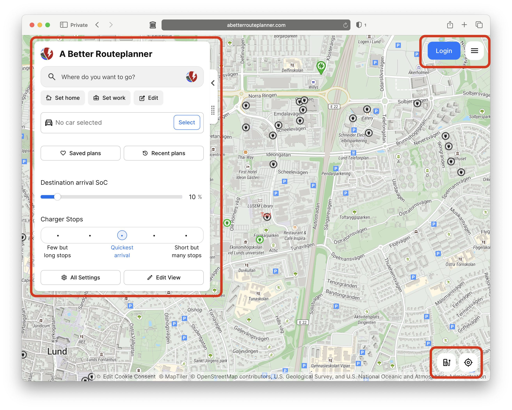

# Getting Started

## A Tour of the ABRP Website

We'll start on the [ABRP website](https://abrp.com), that will make following along with the tutorial easier and you'll get to see some of the planning features that only show up on a large display. If you haven't already done so, click on the **ABRP website** link.

On you're first visit you'll probably be prompted to allow ABRP to use your location. You don't have to allow this for the tutorial, or to use the website for real planning, but since you'll need to allow location access for navigation there may not be a large privacy downside to allowing the web version to also see your current position. So, **make your choice and lets get started.**

{:width="45%"}

Now you can see the ABRP home page, you'll notice that you're in Sweden... That's where ABRP is developed. At the bottom of the page is the cookie notice. There are no targeting cookies, so I think it is safe to just click the Accept button. That will allow the developers to see usage data and reports will be sent if the website crashes. Things will work fine if you chose Deny, and you can see more about the cookies used by clicking Customize... Again, **make your choice and we'll move on to the fun stuff.**

On your first visit to the site, you'll come to the Planning View. So, we'll start our tour there.

At **A** in the upper right hand corner of the ABRP window are the **Login** and **Menu** (**Hamburger**) buttons. The Login button also lets you create a ABRP account. Go ahead and create an account, you'll need one to start the 14-day free trial of ABRP Premium.
