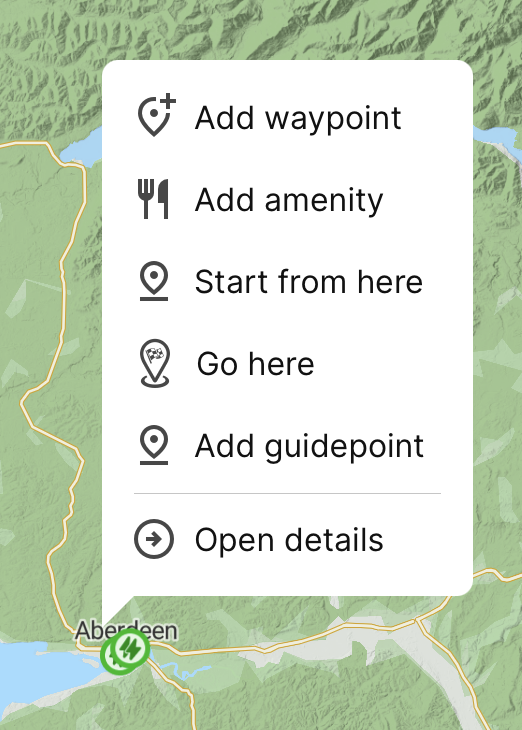

When you right click on the map, a context menu appears with options from the set:
* Add waypoint: add a stop to your route plan.
* Add amenity:
* Start from here: designate the starting point for your trip. Useful if you want to leave from somewhere specfic that is not where you are.
* Go here: designate your destination.
* Add guidepoint: specficy a point to be used in constructing your route plan. ABRP will not plan a stop at the guidepoint, but you will be routed through / close to it. Useful when you want to direct the routing, such as when you are trying to create a "scenic route."
* Open details:

